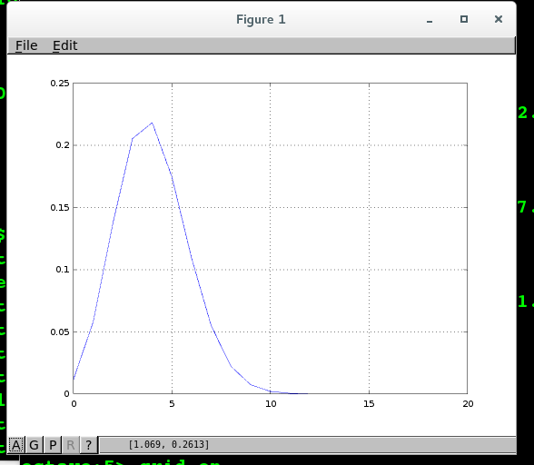

[X, Y] = meshgrid(x, y)
used to create the grid in the 3D coordinator.


#### Octave plot

##### 椭圆及切线

```javascript
% draw a oval(tuo yuan) x^2/16 + y^2/9 = 1
% draw a tangent line in pos(theta = pi/4)

% draw a tangent line in (4/sqrt(2), 3/sqrt(2));
% y = (12*sqrt(2) - 3*x) / 4;

x1 = linspace(-4, 4, 2000);
y1 = (12*sqrt(2) - 3*x1)/4;
plot(x1, y1);
grid on
hold on

% x = 4 * cos(t);
% y = 3 * sin(t);
t = linspace(0, 2*pi, 1000);
x = 4*cos(t);
y = 3*sin(t);
plot(x, y);
```


##### 心型线
```javascript
%r = a(1-cos(theta))
theta = linspace(0, 2*pi, 1000);
r = 5 * (1 - cos(theta));
x = r .* cos(theta);
y = r .* sin(theta);

plot(x, y);
grid on
```


##### Bernoulli Distribution
```javascript
k = [0:1:20];
x = linspace(20, 20, 21);
for n = 1:21
%binomial coefficient
    P(n) = nchoosek(x(1,n), k(1,n)) * ((0.2)^(n-1)) *((0.8)^(21-n));
end

for n = 1:21
    binormialefficient(n) = nchoosek(x(1,n), k(1,n));
end

plot(k, P)
grid on
xlabel("k");
ylabel("P\{X=k\}");
title("Bernoulli Distribution");
```




