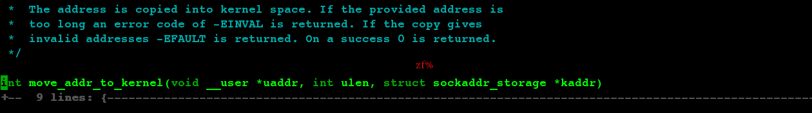

### Tag Stacks
The **ex** command **:tag** and the vi mode **^]** command provide a limited means of finding identifiers,
based on the information provided in a tags file. Each of the vi clones extends this ability
by maintaining *a stack* of tag locations. Each time you issue the **ex** command :tag, 
or use the vi mode ^] command, the editor saves the current location  before searching for
the specified tag. You may then return to a saved location using (usually) the vi command 
**^T** or an ex command(**:pop**).

|^] | Look up the location of the identifier under the cursor in the tags file, and move to the location. The current location is automatically pushed onto the tag stack.|
|^T | Return to the previous location in the tag stack, i.e., pop off one element. A preceding count specifies how many elements to pop off the stack.|
|:tags | Display the contents of the tag stack|

### Auto and Smart Indenting

When you paste text into your file where automatic indenting is turned on, Vim considers this regular input and 
applies all automatic indentation rules. It will cause the copied code have large indentation.

To avoid this awkward situation and to paste text intact without side effects, set Vim's 
**paste** option before adding imported text. **paste** comprehensively reconfigures all of Vim's automatic
features to faithfully incorporate pasted text. To return to automatic mode,
simply reset the **paste** option with the command **:set nopaste**.

    :set paste
    :set nopaste

### Fold methods
Fold commands all begin with z.

|zA | Toggle the state of folds, recursively|
|zC | Close folds, recursively|
|zD | Delete folds, recursively|
|zE | Eliminate all folds|
|zf | Create a fold from the current line to the one where the following motion command takes the cursor|
|*count*zF|Create a fold covering count lines, starting with the current line|
|zO|Open folds, recursively|
|zc|Close one fold|
|zd|Delete one fold|
|zo|Open one fold|

### Syntax Highlighting

|:syntax enable | Display a file's syntax highlighting|
|:syntax on | Enable syntax|
|:set syntax=sh | Force Vim to use the syntax highlighting of your choice by setting the syntax manually form the command line.|
|:colorscheme *schemeName* | Changes colors for different syntax highlights such as comments, keywords,
or strings by redefining these syntax groups|
|:set background? | Set background color your screen has|

syntax files are in $VIMRUNTIME/syntax directory.
### Compiling and Checking Errors with Vim

:make fibonacci

