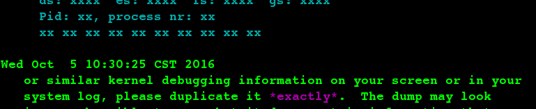

Change options from within vi by using the ex command ":set".

|:set ic|Pattern search should ignore case|
|:set noic|case-sensitive in searches|
|:set all|Display the complete list of options have set|
|:set option?|Show the current value of any individual opiton by name|
|:set |Show options that you have specifically changed, or set.|

An exclamation mark (!) tells *ex* to create a shell and to regard what follows as a Unix command:
    
    :!command

Read the results of a Unix command into your file.

    :r !date

|:96,99!sort|Pass lines 96 through 99 through the *sort* filter and replace those lines with the output of *sort*.|

### Word Abbreviation

|:ab abbr phrase|Define an abbreviation, abbr is an abbreviation for the specified *phrase*|

The sequence of characters that make up the abbreviation will be expanded in insert mode only 
if you type it as a full word; abbr will not be expanded within a word.

:ab imrc International Materials Research Center

|:ab|List your currently defined abbreviations|

#### Using the map command

Assign the command sequence to an unused key by using the map command.

|:map x sequence| Define character x as a sequence of editing commands|
|:unmap x |Disable the sequence defined for x|
|:map|List the characters that are currently mapped.|

|:s;.*;/* & */;|Place C/C++ comments around an entire line|

### Indentation Control

When you are entering code with autoindent enabled, in insert mode

|CTRL+T|Give you another level of indentation|
|CTRL+D|Takes one away|
