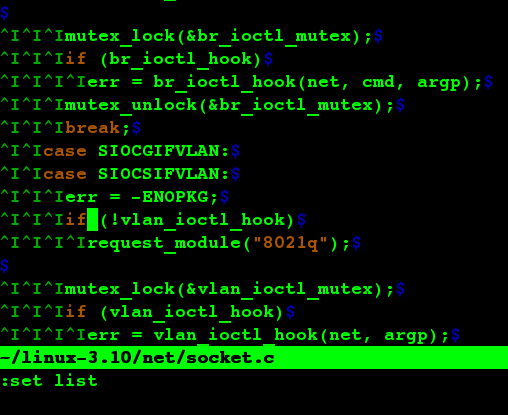

|:set list|display a tab appears as the control character^I and an end of line appears as a $|
|:5,20 l|displays lines 5 through 20, showing tab characters and end-of-line characters.|

ctags create an information file that vi can use later to determine which files define which funcitions.

|:!ctags file.c|Create a file named tags in current directory that contains info on the functions defined in file.c|

|:tag name|looks at the tags file to find out which file contains teh defination of the function name.|
