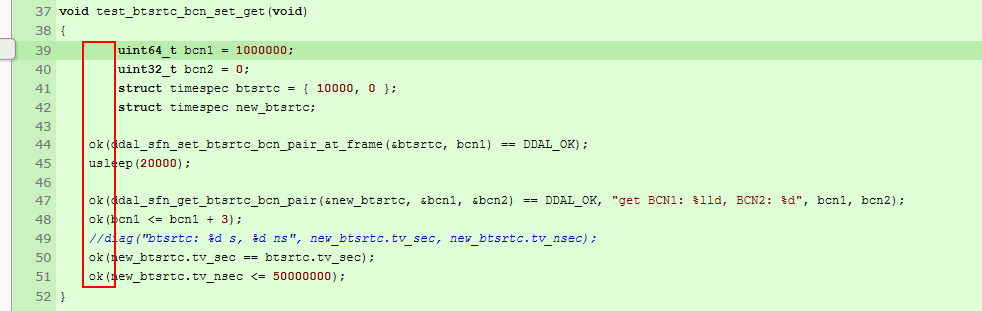
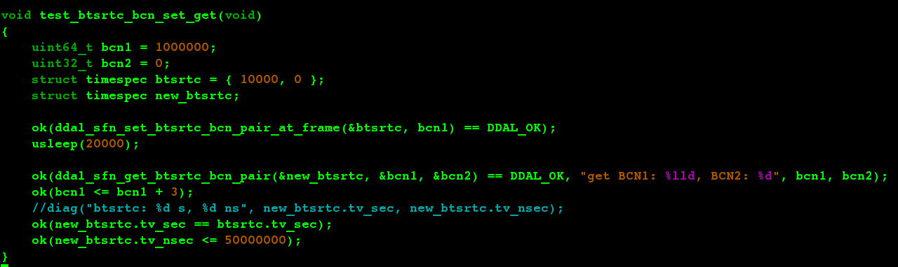
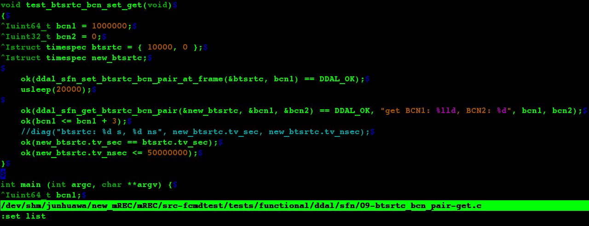

A weird thing happen when I send out my code to review from review board. The
C Code Indentation is wrong. 


But it's ok in my vim editor.



Set `set list` in the vim, it will display unprintable characters.


From this, we can see some line have **tab**, but some don't have. This is the root cause.
So, we need to use same character to indent. 

#### Indentation without hard tabs

Modify vim configuration, For indentation without tabs, the principle is to set 'expandtab', and set 'shiftwidth' and 'softtabstop' to the same value, while leaving 'tabstop' at its default value:

```vim
    set expandtab
    set shiftwidth=2
    set softtabstop=2
```

These settings will result in spaces being used for all indentation. 


[Indent Source Code](http://vim.wikia.com/wiki/Indenting_source_code)
