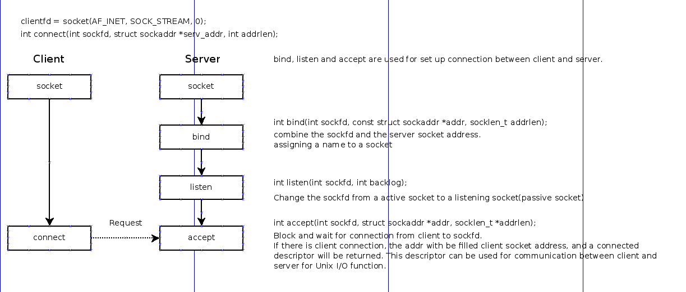

网桥: 帧可以穿过网桥，网桥还有增加带宽的功能，因为如果一个数据报的目的地不是在网桥的另一端，该数据报就不会被传到网桥的另一端，
    一个数据报经过网桥的时候，只会沿着目的地方向传送，而不会被广播。

集线器: 要广播所有的包

路由器: 工作在IP层。

互联网络思想的精髓：封装是关键

IP: 一台主机往其他主机发送数据包，也叫数据报(datagram)

UDP: Unreliable Datagram Protocol

    扩展了IP协议，在进程间而不是在主机间传送包；

TCP: Transmission Control Protocol

    IP之上的复杂协议，提供进程间可靠的全双工连接。

应用往网络发送数据报，先加IP包头，再加帧头，然后传到网络上，在另一端，先经过数据链路层，去除帧头，再传送给IP层去除IP头。

### Socket Interface

Why we need a listening file descriptor, and a connected descriptor? 

see `man 3 accept` for more details.
