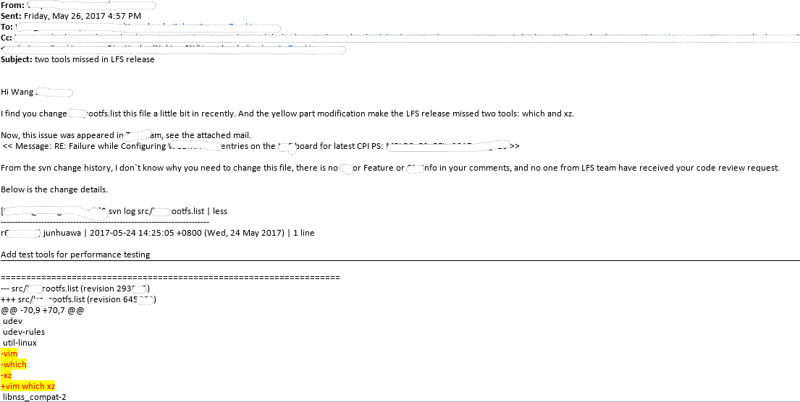

#### 事情经过

我喜欢把代码仓库在/dev/shm/junhuawa目录下面checkout(即内存里)，因为在内存，怕断电丢失change，所以经常做了改动就checkin了。

在开发新的feature，编译LFS时，需要在LFS包含的包里加上几个额外的包用于测试 (sysbench, iperf3, lmbench3).

在修改了包管理工具rootfs.list后，我顺手commit了change.

因为这个是svn管理的仓库，commit之后就触发了CI重新编译，跑Case。并且编译出来的包会被Application 拿去进一步测试。

几天之后，忽然收到邮件，说我的没有经过review的change导致了Application Test
case失败！！！

经过调查，我commit的change有不应该有的改动，让大家大跌眼镜

    Index: lrc_rootfs.list
    ===================================================================
    --- lrc_rootfs.list (revision 293005)
    +++ lrc_rootfs.list (revision 645669)
    @@ -70,9 +70,7 @@
    udev
    udev-rules
    util-linux
    -vim
    -which
    -xz
    +vim which xz
    libnss_compat-2
    libnss_dns-2
    libnss_files-2
    @@ -96,3 +94,6 @@
    smartmontools
    vlan    # requested by TRSW
    arptables  # requested by pengying.li@nokia.com to configure the ARP packet priority in new feature LBT3211
    +sysbench
    +iperf
    +lmbench3

因为我的不应该有的改动，导致编译出来的rootfs没有包含(vim, which, xz)
三个工具，导致Application 的case通不过，CI失败。 

**没有经过review的change commit到svn server太可怕了！！！**

#### 血的教训

    Change必须经过review才能merge到server端。
    SVN的commit功能太可怕了！要谨慎使用.

#### 我今后的改进

    以后在Sprint开发过程中坚决不要用svn这个代码管理工具, 改用git来管理本地code, 以防后患;
    对于代码的commit，一定要follow正式的流程，经过review才merge到repo;
    以前总是在内存中改/checkout代码，正是怕丢，所以急着commit，这个习惯要改，如果着急，可以在memory checkout代码，编译完copy到disk，开发工作还是要在disk上，这样就不会有丢失的风险！！！

