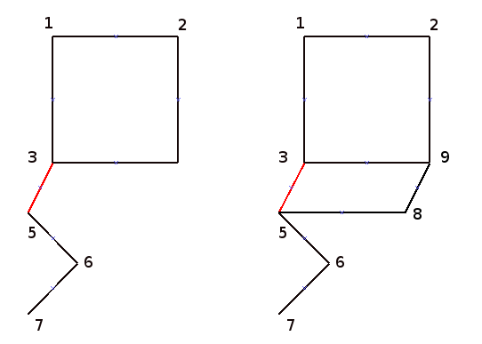

#### Problem 5

Nokia is going to deploy the Base Transceiver Station in Hangzhou. The city will be divided into N (1 ≤ N ≤ 2,000) areas (conveniently numbered 1..N), and the stations will be set up in some of these areas so the mobile phone signal will cover the entire city.

There are X (1 ≤ X ≤ N) pairs of areas are adjacent, and two areas A and B (1 ≤ A ≤ N; 1 ≤ B ≤ N; A ≠ B) in each pair. There can be only 1 station in 1 area, and each station has enough power to provide service to the area it's on and all the adjacent areas to the area with the station.

Please caculate the minimum number of stations that must be installed to provide mobile phone service to the whole city

诺基亚要在杭州铺设基站。整个城市会被分割为N(1 ≤ N ≤ 2,000)个区域，并把它们按照(1..N)编号。基站可以架设到这些区域里，并且基站信号需要覆盖整个城市。

这些区域之间有X对相邻关系，每对相邻关系包含两个区域A和B(1 ≤ A ≤ N; 1 ≤ B ≤ N; A ≠ B)。每个区域最多架设一个基站，而且每个基站都有足够的功率可以覆盖到与它所在小区相邻的小区。

请计算至少需要安装多少个基站才能给整个城市提供移动电话服务。

##### Input

The first line is the number of all user cases.

第一行表示文件中测试用例的总数。随后的每一行代表一个测试用例。

The 1st number is a single integer: N, the number of areas, and the each pair of integer after it specifies a pair of adjacent areas with space-separated integers: A and B

第一个数字表示总的区域个数，后面每两个数字表示一对相邻小区的编号，A和B，它们之间用空格分割

N A1  B1 A2  B2 ...

##### Output

For each test case, output one line containing "Case #x: y", where x is the test case number (starting from 1) and y is the minimum number of base stations to install

对应每个测试用例，要求输出一行形如：“Case #x: y”，其中x表示测试用例的序号（从1开始），y表示最少需要安装的基站个数

##### Sample Input

    2
    4 1 2 1 3 1 4
    5 1 2 3 4 2 4 3 5

##### Sample Output

    Case #1: 1
    Case #2: 2

#### Solution

正如小时候老师告诉我们解题方法，可以先将简单的问题解决，把问题规模缩小，然后再一步步缩小范围，最后应该可以把问题解决. 步骤如下:

1. 将所有孤立的节点找出来，这些点均需安装基站；
2. 将所有只有一条边的2个节点找出来，2个节点，他们自己是邻居，跟别的节点都不是邻居，那么他们中挑一个节点建立基站就可以了；
3. 现在处理很多节点连在一起的情况，
   对于只有1条边的节点 A，在该节点或者其邻居 B 上必须建一个站，因为邻居节点 B 连接的节点会更多，所以应该在邻居节点 B 上建站, 这样可以覆盖更多的节点；

   在B上建完站之后，A，B节点及连边都可以从图上删掉，还有一些特殊情况需要考虑：

在Node 5, Node 7上建站后，Node 3, 4, 6, 8, 5, 7
都已经被覆盖，在接下来的计算中，Node 3，4连边已经不需要了，所以需要删掉！ Node
3, 4 的状态应该是COVERED.

在Node 6上建站后，Node 5 已经被覆盖，所以Node 3 和 5的连边需要删掉！

4.
递归的执行1，2，3，直到问题规模不能继续缩小，这时候碰到的应该是类似于环的图,
而且环中的个别节点已经被覆盖。

因为这时候问题规模已经很小，可以直接用暴力求解的方法将需要覆盖的最小点数求出来。

这个题最开始我也没有做出来，我把它想成顶点覆盖问题，一直解不出来。
后来经过高人点拨，才知到可以通过先易后难，将问题规模缩小来求解！

在解这个题时，`总是会混淆点和边的区别，问题的目标是把所有的顶点全部覆盖，而不是所有的边，因此有些边直接可以删掉的！`

