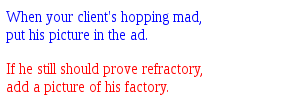

#### html tag (标签)

| tag | function description |
| :--------- | :-------- |
| <html> ... </html>| 包含整个HTML文档 |
| <head> ... </head>| 包含HTML文档的标题 |
| <title> ... </title> | 指明文档的标题，用于<head> 内 |
| <body> ... </body> | 包含HTML文档的正文 |
| <p> ... </p> | 包含一个段落，段落间隔一行 |
| <br /> | 分行 |
| <hr /> | 水平标尺线 |
| <h1> ... </h1> | 一级标题 |
| <h2> ... </h2> | 二级标题 |

#### CSS(Cascading Style Sheet) 层叠样式单

层叠样式表(英文全称：Cascading Style Sheets)是一种用来表现HTML（标准通用标记语言的一个应用）或XML（标准通用标记语言的一个子集）等文件样式的计算机语言。CSS不仅可以静态地修饰网页，还可以配合各种脚本语言动态地对网页各元素进行格式化。

CSS 能够对网页中元素位置的排版进行像素级精确控制，支持几乎所有的字体字号样式，拥有对网页对象和模型样式编辑的能力。

CSS的动机很简单: 创建一个独立的样式单文件，以指定字体，颜色，背景和其他确定网站外观的特征。然后链接需要使用该样式单的所有网页，而不是在每个文档中都重复指定这些样式。也就是说，样式单是一组格式化指令，能够同时控制众多HTML页面的外观。

CSS样式可以直接存储于HTML网页或者单独的样式单文件。无论哪一种方式，样式单包含将样式应用到指定类型的元素的规则。外部使用时，样式单规则被放置在
一个带有文件扩展名.css的外部样式单文件中。 


CSS中的"层叠(cascading)"表示样式单规则应用于HTML文档元素的方式。CSS样式单中的样式形成一个层次结构，更具体的样式覆盖通用样式。
样式规则的优先级由CSS根据这个层次结构决定，从而实现级联效果。

```html
    <div style="color:red">
    <p style="color:blue">
    When your client's hopping mad, <br />
    put his picture in the ad.
    </p>

    <p>
    If he still should prove refractory, <br />
    add a picture of his factory.
    </p>
    </div>
```



    font-family: Verdana, Geneva, Arial, Helvetica, Sans-serif;

font-family
属性指定一个有优先级的字体集体名称列表。使用有优先级的列表而不是一个值，旨在防止特定系统中没有安装指定的字体。

#### 样式类
CSS样式属性是一个可赋值的具体样式，如color或font-size。通过选择符(selector)将样式规则及值同网页中的元素关联起来。选择符用于标示网页中要
应用样式的标签。

    h1 { font: 36pt Courier;}

这行代码中，h1是选择符，font是样式属性，而36pt
Courier是值。选择符很重要，因为它意味着该字体设置将应用于网页中所有的h1元素。

如果你想在文档中使用两种不同的<h1>标签，可以为每种标签创建一个样式类:

    h1.silly { font: 36pt Comic Sans;}
    h1.serious { font: 36pt Arial;}

在HTML页面中需要选择这两个样式之一时，可使用class属性:

    <h1 class="silly">Marvin's Munchies Inc.</h1>

##### 使用样式ID

如果某个样式在一个页面中只出现一次，可以使用样式ID.

    p#title{font: 24pt Verdana, Geneva, Arial, sans-serif}

在HTML代码中引用样式ID时，只要在元素的id属性中指定ID名称就可以了。

    <p id="title">Some Title Goes Here</p>

总共有3种样式单，外部样式单

    <link rel="stylesheet" type="text/css" href="styles.css" />

内部样式单(不知道为什么测试不成功！)

    <head>
        <title>About BAWSI</title>

        <style type="test/css">
            div.footer {
                font-size: 20pt;
                line-height: 12pt;
                text-align: center;
            }
        </style>
        </head>

内联样式单

```html
    <p style="color:green">
        This text is green, but <span style="color:red"> this text is
        red.</span>
        Back to green agan.
    </p>
```


#### 3种HTML列表
有序列表

    以<ol>标签开始，</ol>标签结束，列表项包含在<li></li> 标签对中。 

<li>
<ol> China </ol>
<ol> America </ol>
<ol> Germany </ol>
<ol> Japan </ol>
</li>

无序列表

    包含在<ul></ul>标签对中，列表项包含在<li></li>标签对中。

定义列表

    包含在<dl></dl>标签对中， <dt></dt>标签对包含每个项目，<dd></dd>
    标签对包含每个定义。 换行和缩进自动出现。 

有序列表和无序列表可以互相嵌套，嵌套的级别可以任意深。

#### 使用特殊字符

    HTML/XHTML使用特殊代码（称为字符实体）来表示特殊字符，字符实体总是以“&”开始，以“;"结束。

#### 表格

表格由多行信息组成，每行包含单元格。要创建表格，必须以<table>标签开始。


#### Scripts used in the Web

在web开发中，有2种脚本类型: 服务器端和客户端。

##### 用于服务器脚本

    PHP, JSP, ASP, Perl, Python, Ruby

##### 客户端脚本(javascript)

JavaScript - 用于客户端脚本(运行在浏览器中的脚本, 最流行的客户端脚本语言)

JavaScript代码可以存在于文件中的2个位置之一:
    在以.js为扩展名的独立文件中；
    直接存在于HTML文件中。 

在HTML文件中，浏览器通过<script></script>标签来了解它的存在。

    <script type="text/javascript" src="/path/to/script.js">

<script></script>标签一般放置在<head></head>标签之间，
因为它严格地说不属于页面正文中的内容。相反，<script>标签建立一组JavaScript函数或者页面其余部分可使用的其他信息。
但是，必要的时候，你可以将JavaScript函数或者代码片段用<script>标签封装并且将它们放置在页面的任何地方。 

As a rule, only the simplest scripts are put into HTML. More complex ones reside in separate files.

The benefit of a separate file is that the browser will download it and then store in its cache.

After this, other pages which want the same script will take it from the cache instead of downloading it. So the file is actually downloaded only once.

That saves traffic and makes pages faster.


### <div>

The <div> tag defines a division or a section in an HTML document.

The <div> tag is used to group block-elements to format them with CSS.

The <div> element is very often used together with CSS, to layout a web page.
By default, browsers always place a line break before and after the <div> element. However, this can be changed with CSS.

### anchor <a> (锚)

<a>标签是负责Web上的超链接的标签，它的名称来自于"anchor"(锚)一词，意思是链接的是网页上的一个特定的位置。

<a>标签可以用来将页面上的某个位置标记为锚，是你可以创建一个指向具体位置的链接。

    <a id="top"></a>

<a>标签一般用href属性来指定超链接的目标，<a href>是你所点击的，<a id>是点击后所转向的位置.

    <a href="#top">Return to Index. </a>

\#符号意味着top指向当前文档中的命名锚接点而不是单独的页面。 当用户单击Return to Index, Web 浏览器显示以<a id="top">标签开头的部分.


### href="#"

scroll to top. 
href="#" doesn't specify an id name, but does have a corresponding location -
the top of the page. Clicking an anchor with href="#" will move the scroll
position to the top.

### caption

caption 元素定义表格标题。

caption 标签必须紧随 table 标签之后。您只能对每个表格定义一个标题。通常这个标题会被居中于表格之上。

<table border="1">
  <caption>Monthly savings</caption>
  <tr>
    <th>Month</th>
    <th>Savings</th>
  </tr>
  <tr>
    <td>January</td>
    <td>$100</td>
  </tr>
</table>
