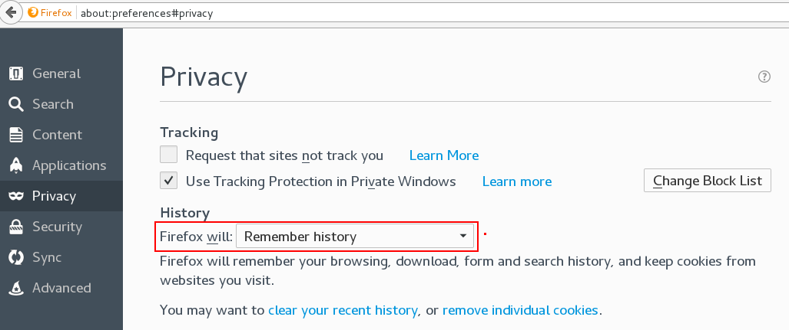

The HTML DOM document object is the owner of all other objects in your web page.
The document object represents your web page.

If you want to access any element in an HTML page, you always start with accessing the document object.

Below are some examples of how you can use the document object to access and manipulate HTML.

    document.getElementById(id)     Find an element by element id
    document.getElementsByTagName(name)     Find elements by tag name
    document.getElementsByClassName(name)   Find elements by class name, 但是同一个class会有很多个element，因此这时候会返回很多个元素，需要遍历.

document 只能在客户端使用，在server端要输出测试log，可以用console.log().
在server端执行js程序:

    node random_quote.js

一个javascript函数是一段实现特定功能的代码。它在被调用时执行。

函数定义:
    
```javascript
    function name(parameter1, parameter2, parameter3){
        code to be executed
        }
```

匿名函数
    
```javascript
    this.draw_graphs = function()
    {
        if (this.graphs.length > 1) {
            var columns = new Array();
            columns[0] = 1;
            this.joined_data = google.visualization.data.join(this.graph_data[0].graph_data, this.graph_data[1].graph_data, 'full', [[0, 0]], [1], [1]);
            for(var i = 2; i < this.graphs.length; i++) {
                columns[i-1] = i;           
                this.joined_data = google.visualization.data.join(this.joined_data, this.graph_data[i].graph_data, 'full', [[0, 0]], columns, [1]);
            }
        } else {
            this.joined_data = this.graph_data[0].graph_data;
        }   
    }
```


[javascript](https://www.w3schools.com/js/js_functions.asp)


```javascript

    <!DOCTYPE html>
    <html>
    <body>

    <p id="myP">I am a paragraph.</p>

    <p>Click the button get the HTML content of the p element.</p>

    <button onclick="myFunction()">Try it</button>

    <p id="demo"></p>

    <script>
    function myFunction() {
        var x = document.getElementById("myP").innerHTML;
        document.getElementById("demo").innerHTML = x;
    }
    </script>

    </body>
    </html>
```
The innerHTML property sets or returns the HTML content (inner HTML) of an
element.


Javascript 是一门阻断式语言。

ECMA-263第三版中定义的ECMAscript是各浏览器实现最多的一个版本。

ECMAScript标识符采用驼峰大小写格式，即第一个字母小写，剩下的每个有意义的单词的首字母大写。

ECMAScript语句以一个分号结尾，如果省略分号，则由解析器确定语句的结尾。

ECMAScript的变量是松散类型的，所谓松散类型就是可以用来保存任何类型的数据。还句话说，**每个变量仅仅是一个用于保存值的占位符而已**。
定义变量时要使用`var`操作符，未经初始化的变量会保存一个特殊值- **undefined**.

有一点必须注意，即使用 var 操作符定义的变量将成为定义该变量的作用域中的局部变量。 

省略var操作符，可以创建一个全局变量。 

如果定义的变量准备在将来用于保存对象，那么最好将该变量初始化为 null 而不是其他值。

#### Debug Javascript in the Browser

`F12` show the console log.

    console.log() can print log to the Browser console.

    Show which where the HTML code is displayed in the Web Browser:

Developer -> Network -> Inspector

#### JQuery Syntax

    $('#random_and_compression').on('shown.bs.collapse', function () {
        ...
    })

JQuery 是一个Javascript的库，使用该库，可以让代码变得很简洁！

#### Syntax highlight not work sometimes in html file

Sometimes syntax highlight would just stop working when looking at the javascript section in an .html file. As the OP mentions, a quick workaround was to scroll up and then magically things would start highlighting again.

Today I found the underlying problem and a good solution. **In Vim, syntax highlighting uses a context to derive the correct highlight, where context is defined by the previous lines.** It is possible to specify how many lines before the current line are used by issuing **:syntax sync minlines=200**. In this case, it will use up to 200 previous lines as context. It is possible to use the whole file (which can be slow for long files) by running **:syntax sync fromstart**.

Once I found that, I added this line to my .vimrc:

    **autocmd BufEnter *.html :syntax sync fromstart**

By doing so, .html files will use the whole file as context. Thus, the javascript section will always by highlighted properly, regardless of how long the JS section is. Hope this helps someone else out there!

[HTML Syntax Highlight](https://stackoverflow.com/questions/58825/javascript-syntax-highlighting-in-vim)


#### Enable cookie in the Firefox

Preferences -> Privacy -> History 


