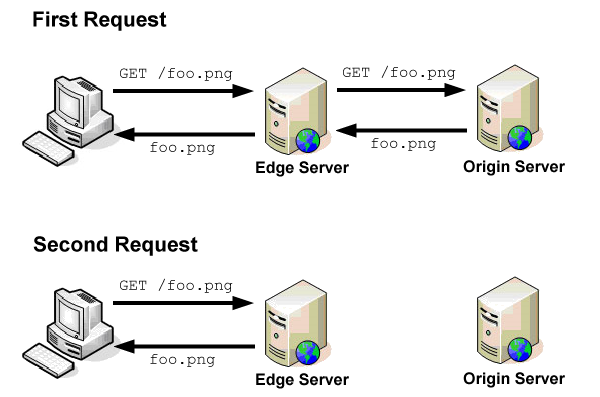

## How content delivery networks (CDNs) work(内容分发网络是如何工作的)

[How CDN Works](https://www.nczonline.net/blog/2011/11/29/how-content-delivery-networks-cdns-work/)

CDN是互联网架构的重要组成部分，频繁的被使用，但是很少有人了解背后的处理过程。
你经常听到人们说"哦，我们把它放到CDN上"或者"确保静态数据保存在CDN',
其实，他们对CDN是什么和其如何工作并不了解。
正如大多数技术一样，CDN实际上没有那么神秘，它实际上以一种相对简单和直接的方式工作。

当浏览器对一个资源发出请求时，生成一个DNS请求是其第一步。DNS请求类似于在一个黄页上查找电话号码:
浏览器发送域名，期望返回一个IP地址。 通过IP地址，浏览器可以直接和Web
server进行接下来的交互(有多层DNS缓存，但是这个超出了这个blog的范围). 
对于简单的blog或者商业网站，一个域名通常有一个IP地址；对于大的Web应用，单个域名可能有多个IP地址与其对应。 

一个计算机与另一个计算机的通信受到物理链接的限制，因此如果你尝试在美国访问一个中国的服务器，比在美国访问一个美国的服务器要花去更多的时间。
为了改进用户体验和降低传输成本，大公司在全球范围内的战略地理位置搭建服务器，这些服务器保存数据的备份。
这就叫做CDN，这些服务器叫作边界服务器(`edge servers`),
因为他们是最靠近终端用户的处在公司网络中的服务器。

### DNS 解析
当浏览器向一个由CDN处理的域名发送一个DNS请求时，接下来的行为和向一个小的网站发送请求有轻微的区别。DNS服务器接收到域名后，查找到一个最佳的处理这个request的服务器集合。简单来说，DNS服务器根据DNS 请求端的IP地址来查找到一个地理位置靠近该区域的边界服务器，并将该服务器地址发送给终端。
比如，如果我发送了一个请求，我的请求被路由到位于Virginia的DNS
resolver，则我将获得一个位于East Coast的服务器的IP地址，
如果我在California发出同样的请求，则我会获得一个位于West
Coast的服务器的IP地址。因此，在不同的地理位置发出请求，DNS解析出来的服务器地址是不同的。

这个是CDN工作的第一步:
尽可能的返回离请求最近的服务器。记住，公司可能用其他方式来优化他们的CDNs.
比如，重定向到一个更可靠的服务器，或者一个空闲的服务器(如果另一个已经满载运行)。总之，CDN会返回一个最好的IP地址来处理客户的请求。

### 获取内容(Accessing Content)
边界服务器，工作方式和浏览器缓存类似，是一个代理缓存.
当边界服务器接收到一个请求，它首先在缓存中查找是否有这个内容。缓存key是包含查询字符串的整个URL(同浏览器中的一致).
如果发现缓存中有对应内容，而且缓存没有过期，则会直接使用边界服务器中的缓存内容作为响应。

另一方面，如果缓存中的内容不存在，或者缓存已经过期，则边界服务器向源服务器发送一个请求，获取信息.
源服务器是内容真正的源，并且它能向CDN提供所有需要的数据.
当边界服务器从源服务器接收到响应，它会根据响应的HTTP头信息在缓存中保存内容。 

Yahoo!创建并开源了Apache Traffic Server，Yahoo在他的CDN中用它来管理流量.
如果你想了解代理缓存如何工作，强烈建议阅读Traffic Server Documentation.

### Example
举个例子，Yahoo提供YUI 库文件，这个文件可以通过combo handler这个工具来获取.
The combo handler发出一个请求，在这个请求里包含两个合并的文件名.
以下是一个例子URL:

    http://yui.yahooapis.com/combo?3.4.1/build/yui-base/yui-base-min.js&#038;3.4.1/build/array-extras/array-extras-min.js

域名`yui.yahooapis.com`是Yahoo
CDN的一部分，这个请求会被重定向到离你这个位置最近的边界服务器.
这个特殊的请求请求2个文件yui-base-min.js和array-extras-min.js，
期望的响应包含2个文件. 执行2个文件合并的逻辑不在边界服务器，只存在于源服务器。
因此，如果一个边界服务器接收到这个请求，发现在边界服务器没有内容，则将请求转发到源服务器。在源服务器运行着combo
handler(在URL中由`/combo?`指定).
因此源服务器会将2个文件合并，并将结果发送给边界服务器，边界服务器再将结果放送给请求端。

### What does static mean?
当我描述类似于combo handler的系统时，我总是感到迷惑。大家有一个误解:
CDN就像FTP仓库一样，再CDN上上传静态文件，别人可以从CDN获取这些文件。
我希望你从上面的描述得出结论事实并非如此。
一个边界服务器是一个代理，源服务器告诉边界服务器当一个请求来时应该返回什么内容。
源服务器可能运行Java, Ruby, Node.js, 或者任何其他类型的Web
server，因此可以做任何事情。
边界服务器只是向源服务器发送请求，向终端侧发送内容。 因此YUI combo
handler只存在于源服务器，而不在边界服务器。

既然这样，为什么不在CDN上保存所有的东西呢？
CDN是一个cache，意味着当他将数据直接发给客户，而不需要通过源服务器来处理时是有价值的。如果对于每一个请求，边界服务器都要向源服务器发送请求，则CDN就没有价值了(实际上，这时比将请求直接发送给源服务器代价更高).

Javascript, CSS, Images, Flash, audio, and video
频繁的被存放在CDN，原因在于它们改动不频繁。
这意味着同一个用户总是从cache里获取内容，而且所有的用户都从cache中获取相同的内容。 一旦Cache中保存了这个内容，所有的用户将从中受益。
在边界服务器中保存一个网站的主页并不是一个好主意，因为主页经常要更新，而且主页对于每个用户经常要定制。

### Cache Expiration
Yahoo! performance guidelines
明确对于静态数据，它的header上指定应该有更常的超时时间. 这个有2个原因: 
    浏览器缓存资源的时间更长;
    CDN对于这个资源将缓存更长的时间.
这样做意味着你不能2次使用相同的文件名，因为数据可能缓存在2个地方，相隔一段时间，用户获取的极有可能是缓存的老的数据，而不是新的.

有几种方法可以避免这个问题，YUI库使用带有库版本号的目录来区分不同的文件版本.通常也可以在文件名后面添加标示符, 比如MD5 hash或者source control revision. 这些技巧都确保当大的超时时间被使用时，用户获取到最新版本的文件. 

### 结论
CDN是当今互联网的重要部分， 随着时间的推移将会越来越重要。
为了给客户提供更快的体验，很多公司在寻找可能的方法，将更多的功能移到边界服务器。这其中包括一种叫作Edge
Side Includes(ES)的技术， 该技术从缓存中提供部分页.
对CDN的充分理解，有助于你给用户提供更好的体验。 

