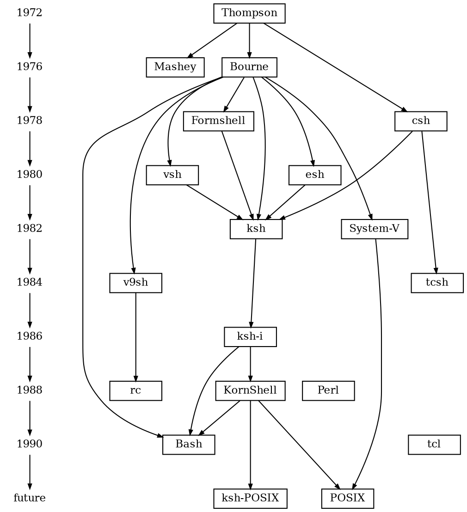
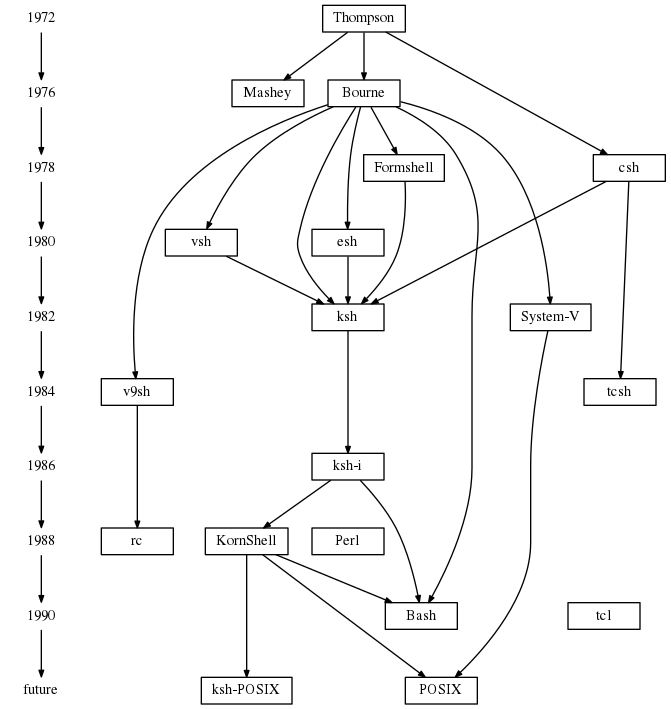
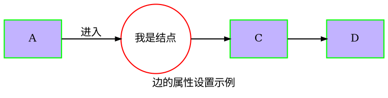
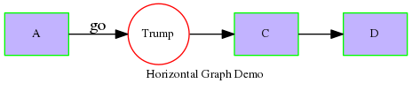

You need to install the `graphviz` which have `dot` cmd. 

    [root@Tesla junhuawa]# rpm -ql graphviz-2.30.1-19.el7.x86_64
    /usr/bin/acyclic
    /usr/bin/bcomps
    /usr/bin/ccomps
    /usr/bin/circo
    /usr/bin/cluster
    /usr/bin/diffimg
    /usr/bin/dijkstra
    /usr/bin/dot
    /usr/bin/dot2gxl
    /usr/bin/dotty
    /usr/bin/fdp
    /usr/bin/gc
    /usr/bin/gml2gv
    /usr/bin/graphml2gv
    /usr/bin/gv2gml
    /usr/bin/gv2gxl
    /usr/bin/gvcolor
    /usr/bin/gvgen
    ...

graphviz 这个包里包含了很多种画图命令，比如fdp, dot, circo, neato ...,
这些工具可以画出各种各样的图形. 

       dot - filter for drawing directed graphs
       neato - filter for drawing undirected graphs
       twopi - filter for radial layouts of graphs
       circo - filter for circular layout of graphs
       fdp - filter for drawing undirected graphs
       sfdp - filter for drawing large undirected graphs

还有一些GUI的绘图工具: dotty

    dotty - A Customizable Graph Editor

用dot命令输出不同格式的图文件: 

    dot -Tps input.dot > output.ps
    dot -Tpng input.dot > output.png

http://www.linuxdevcenter.com/pub/a/linux/2004/05/06/graphviz_dot.html

dot is a scriptable, batch-oriented graphing tool; it is to vector drawing programs as LaTeX is to word processors.

一种文本图形描述语言. 它提供了一种简单的描述图形的方法，并且可以为人类和计算机程序所理解。DOT语言文件通常是具有.gv或是.dot的文件扩展名

很多程序都可以处理DOT文件。其中的一些，例如dot，neato，twopi，circo,
fdp与sfdp，会读取DOT文件并将之渲染成为图形格式。其它的一些，比如gvpr，gc，accyclic，ccomps，sccmap和tred，可以读取DOT文件并对它代表的图形进行一些处理。类似于GVedit，lefty，dotty和grappa则提供了交互式的界面。以上程序大部分都包括在了Graphviz软件包中。

dotty, the dot diagram interactive editor, comes with GraphViz and can read and generate dot code.
http://graphs.grevian.org/example

DAG: Directed Acyclic Graph 有向无环图(无回路有向图)

### Dot language key words

| -- | -- | -- |
| digraph | 有向图 | -> |
| graph | 无向图 | -- |

### 例子
比如下面的dot代码，可以生成如下的图形:

也可以生成横向的图形:

### 参考文档

[dot 学习笔记](http://liyanrui.is-programmer.com/posts/6261.html)

[Drawing graphs with dot](http://www.graphviz.org/pdf/dotguide.pdf)

