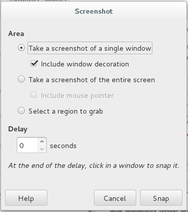

1. [My Linux OS](#my-linux-os)
1. [How to return terminal from a ssh connection](#how-to-return-terminal-from-a-ssh-connection)
1. [Tool to manipulate pictures](#tool-to-manipulate-pictures)
1. [bittorrent client](#bittorrent-client)
1. [Get a rpm package's content](#get-a-rpm-packages-content)
1. [Convert an rpm package to cpio archive package](#convert-an-rpm-package-to-cpio-archive-package)
1. [Query rpm package owning file "/etc/environment](#query-rpm-package-owning-file-etcenvironment)
1. [Create a terminal in linux terminal](#create-a-terminal-in-linux-terminal)
1. [Tool to manage ssh sessions in Linux](#tool-to-manage-ssh-sessions-in-linux)
1. [Use Jabra UC VOICE 750 Duo Drk in Redhat](#use-jabra-uc-voice-750-duo-drk-in-redhat)
1. [Use usb device in the windows VM in Redhat](#use-usb-device-in-the-windows-vm-in-redhat)
1. [Take Screenshots in Linux](#take-screenshots-in-linux)
1. [Firefox address autocomplete](#firefox-address-autocomplete)
1. [Disable save fingerprint of remote machine when using ssh/scp](#disable-save-fingerprint-of-remote-machine-when-using-sshscp)
1. [Dia - A program for drawing structured diagrams](#dia-a-program-for-drawing-structured-diagrams)
1. [Tool for file compare like beyond compare in windows](#tool-for-file-compare-like-beyond-compare-in-windows)
1. [/etc/service](#etcservice)
1. [download rpm packages, not installed](#download-rpm-packages-not-installed)
1. [Install aspell checker](#install-aspell-checker)
1. [Only show file name which grep finds the string "Linux](#only-show-file-name-which-grep-finds-the-string-linux)
1. [Syntax Highlight for Markdown file in Vim](#syntax-highlight-for-markdown-file-in-vim)
1. [Xunlei address translation](#xunlei-address-translation)
1. [How to enter ssh password in a script automatically](#how-to-enter-ssh-password-in-a-script-automatically)

### My Linux OS

    [junhuawa@Tesla Pictures]$ uname -a
    Linux Tesla 3.10.0-327.22.2.el7.x86_64 #1 SMP Thu Jun 9 10:09:10 EDT 2016 x86_64 x86_64 x86_64 GNU/Linux
    [junhuawa@Tesla Pictures]$ cat /etc/redhat-
    redhat-access-insights/ redhat-lsb/             redhat-release          
    [junhuawa@Tesla Pictures]$ cat /etc/redhat-release 
    Red Hat Enterprise Linux Client release 7.2 (Maipo)
    [junhuawa@Tesla Pictures]$ 

### How to return terminal from a ssh connection?

Normal keys are forwarded over the ssh session, so none of those will work. Instead, use the escape sequences. 
To kill the current session hit subsequently Enter ~,..  
Note that escapes are only recognized immediately after newline.

### Tool to manipulate pictures

GIMP: GNU Image manipulation program

Pinta: A very simple image editor. Pinta is a drawing/editing program modeled on Paint.NET. 
Its goal is to provide a simplified alternative to the GIMP for casual users. 

### bittorrent client

    yum search torrent
    yum install qbittorrent

### Get a rpm package's content

    rpm -ql package

    -l, --list List files in package.

    [junhuawa@Tesla tesla-ps]$ rpm -ql qbittorrent
    /usr/bin/qbittorrent
    /usr/share/appdata/qBittorrent.appdata.xml
    /usr/share/applications/qBittorrent.desktop
    /usr/share/doc/qbittorrent-3.3.5
    /usr/share/doc/qbittorrent-3.3.5/AUTHORS
    ...
    /usr/share/pixmaps/qbittorrent.png
    [junhuawa@Tesla tesla-ps]$ 

### Convert an rpm package to cpio archive package

    rpm2cpio *.rpm|cpio -itmv

### Query rpm package owning file "/etc/environment"

    rpm -qf /etc/environment

    [junhuawa@Tesla tesla-ps]$ rpm -qf /etc/environment 
    setup-2.8.71-6.el7.noarch

### Create a terminal in linux terminal

    gnome-terminal -e "ssh root@10.69.120.13"

### Tool to manage ssh sessions in Linux

    pac-4.5.5.7-2.x86_64

fcitx，ibus是输入法的一种框架，具体的输入法一般都有google pinyin,sogou pinyin等；不要将输入法框架和输入法本身搞混淆；

### Use Jabra UC VOICE 750 Duo Drk in Redhat

After plug-in the Jabra, select `Jabra UC VOICE 750a` as the device for sound output/input in `System Tools -> Settings -> Sound`.

### Use usb device in the windows VM in Redhat

* Add vboxusers group for your username, if not, no usb devices can be selected for VM, relogin the user, 
in order for the newly added group to get picked up by your user account.

        sudo usermod -a -G vboxusers  junhuawa  
        groups junhuawa

        [junhuawa@Tesla ~]$ groups junhuawa  
        junhuawa : everybody vboxusers  
        [junhuawa@Tesla ~]$  

* In the USB Settings, Enable USB Controller(USB 2.0 EHCI Controller)

* In the USB Device Filters, select you wanted USB devices  


### Take Screenshots in Linux

* Take a snapshot of screen in linux by PrintScreen Button

        fn + PrintScreen
        The image will be saved to Pictures directory with name "Screenshot from 2016-xx-xx xx-xx-xx.png"

* Take snapshot by Screenshot tool in gnome

It has delay to take snapshot function    


* Use command line, need install imagemagick

        show imagemagick version:
        import --version

        [junhuawa@Tesla misc]$ rpm -qa |grep ImageMagick
        ImageMagick-6.7.8.9-15.el7_2.x86_64
        [junhuawa@Tesla misc]$ 

Command:

    import MyScreen.png

then, use mouse select an area, a png file will be created in current directory.

Show the image:

    eog MyScreen.png

To capture the entire screen after a delay (so you can open some menus or whatever)

    sleep 10; import -window root MyScreenshot2.png

`import -window root`, tells ImageMagick to import the "root" window — that is, the entire screen. 

    sleep 15; import -window root MyScreenshot3.png; gimp MyScreenshot3.png;

Take a screenshot and resize the image to a width of 500 pixels:

    import -window root -resize 500 AnotherScreenshot.png

* Take screenshot with GIMP

To take a screenshot with the GIMP, find the following menu option: `File —> Create —> Screen Shot`. 

You will then be offered some options for the screenshot such as length of delay and whether you want to take a screenshot of the entire screen, or just a window. Click Snap to take the screenshot, 
When you're finished, the screenshot will open in the GIMP editing window. 



[Other methods](http://tips.webdesign10.com/how-to-take-a-screenshot-on-ubuntu-linux)


LXC: linux container

### Firefox address autocomplete

about:config

    Set browser.urlbar.auto* related config to true.

#### Disable save fingerprint of remote machine when using ssh/scp

    $ ssh -o UserKnownHostsFile=/dev/null -o StrictHostKeyChecking=no peter@192.168.0.100
    Warning: Permanently added '192.168.0.100' (RSA) to the list of known hosts.
    peter@192.168.0.100's password:

Also we can set the setting to `/etc/ssh/ssh_config` to let it take effect globally. 
Also can target a particular user, modify the user-specific SSH configuration file (~/.ssh/config).
Also can bypass key checking for a particular subnet (10.56.8.0/24).

> Host 10.56.*.*

    StrictHostKeyChecking no
    UserKnownHostsFile=/dev/null

> bash-4.1$ cat ~/.ssh/config 

    Host 10.56.*.*
        StrictHostKeyChecking no
        UserKnownHostsFile=/dev/null
    bash-4.1$ ssh root@10.56.8.58
    Warning: Permanently added '10.56.8.58' (RSA) to the list of known hosts.
    root@10.56.8.58's password: 
    -bash-4.3# 

### Dia - A program for drawing structured diagrams

[Manual Guide](http://dia-installer.de/doc/en/objects-chapter.html#entering-text)

problem: 

    *. Can change text in a copied box?

        Use F2/Enter Key enter text edit mode(dia version 0.97). 


        Hit Escape/Click outside of editable area leave the Text Edit mode. 

#### What are the five radio-buttons in the Select menu for?

They determine what happens when you drag-select objects. Normally (Replace), only the objects included in the drag area end up selected. By selecting other choices in the Select radio menu, you can change that behavior:

Union

    Both the drag-selected objects and the previously selected objects end up selected. 

Intersect

    The only objects that end up selected are those that were already selected and were drag-selected. 

Remove

    Those previously selected objects that are in the drag area become unselected. 

Invert

    The objects in the drag area change selectedness: Unselected objects become selected, selected objects become unselected. The objects outside the drag area are not affected. 


**These operations correspond to set operations between the previously selected objects and the drag-selected objects.**

### Tool for file compare like beyond compare in windows

    meld

### /etc/service

    provide the service port/protocol map currently used in this machine/server.

### download rpm packages, not installed

    yum install yum-utils
    yumdownloader RPM_Name

### Install aspell checker

    [root@Tesla books]# rpm -qa |grep aspell
    aspell-en-7.1-5.el7.x86_64
    aspell-0.60.6.1-9.el7.x86_64
    [root@Tesla books]# 

    [root@Tesla books]# aspell dump dicts
        en
        en-variant_0
        en-variant_1
        en-variant_2
        en-w_accents
        en-wo_accents
        en_CA
        en_CA-variant_0
        en_CA-variant_1
        en_CA-w_accents
        en_CA-wo_accents
        en_GB
        en_GB-ise
        en_GB-ise-w_accents
        en_GB-ise-wo_accents
        en_GB-ize
        en_GB-ize-w_accents
        en_GB-ize-wo_accents
        en_GB-variant_0
        en_GB-variant_1
        en_GB-w_accents
        en_GB-wo_accents
        en_US
        en_US-variant_0
        en_US-variant_1
        en_US-w_accents
        en_US-wo_accents

aspell -c file

### Only show file name which grep finds the string "Linux"

    grep -l "Linux"

    grep -l prints the filenames whose contents match the pattern, without printing the actual matching lines.

### Syntax Highlight for Markdown file in Vim

If you use `[Pathogen](https://github.com/tpope/vim-pathogen)`, do this:

```sh
cd ~/.vim/bundle
git clone https://github.com/plasticboy/vim-markdown.git
```

Add below in ~/.vimrc to disable fold:

```vim
execute pathogen#infect()
syntax on
filetype plugin indent on
let g:vim_markdown_folding_disabled = 1
```

Install discount which include markdown cmd to convert md file to html.

```sh
[junhuawa@Tesla linux]$ rpm -qa |grep discount
discount-2.1.8-2.el7.x86_64
[junhuawa@Tesla linux]$
```

markdown -o Linux-Use-Note.html 2016-09-02-Linux-Use-Notes.md

### How to enter ssh password in a script automatically

Variant I

    sshpass -p PASSWORD ssh USER@SERVER

Variant II

    #!/usr/bin/expect -f
    spawn ssh USERNAME@SERVER "touch /home/user/ssh_example"
    expect "assword:"
    send "PASSWORD\r"
    interact

### Reverse an applied patch

    patch -p1 -R < path/file.patch
    git apply -R path/file.patch

### How to find the definition of struct module

    use C+\ g/s can't find the wanted. 
    use command: vimgrep "struct module {" * to find the matched files.
    Then use C+\ f to open the matched file.

    [junhuawa@Tesla ccfinderx-core]$ ./autoconf_init.sh 
    ./autoconf_init.sh: line 2: libtoolize: command not found
    aclocal: warning: autoconf input should be named 'configure.ac', not 'configure.in'
    automake: warning: autoconf input should be named 'configure.ac', not 'configure.in'
    automake: warning: autoconf input should be named 'configure.ac', not 'configure.in'
    Makefile.am:10: error: Libtool library used but 'LIBTOOL' is undefined
    Makefile.am:10:   The usual way to define 'LIBTOOL' is to add 'LT_INIT'
    Makefile.am:10:   to 'configure.in' and run 'aclocal' and 'autoconf' again.
    Makefile.am:10:   If 'LT_INIT' is in 'configure.in', make sure
    Makefile.am:10:   its definition is in aclocal's search path.

yum install libtool

#### CentOS minimal eth config

    vi /etc/sysconfig/network-config/ifcfg-enpos
    onboot=yes
    service network restart

####
One of the possible reasons for this is : Unsupported fonts.

Step 1 : From Windows, copy this folder : C:\Windows\Fonts.

Step 2 : Create a new folder in /home directory with the name .fonts (dont forget the dot ".").

Step 3 : Copy the content inside Fonts of Windows to .fonts and also to /use/share/fonts (if you want to use them system wide).

Step 4 : Rebuild your font-cache with fc-cache -f -v or reboot.

### Set static ip addr for network interface in CentOS7

    /etc/sysconfig/network-scripts/ifcfg-enp0s11u1


### Calculator in the linux environment

bc - An arbitrary precision calculator language

It have 4 special variables: scale, ibase, obase, last

`scale` defines how some operations  use  digits  after  the  decimal point.   The  default  value of scale is 0. 

`ibase` and `obase` define the conversion base for input and output numbers.  The default for both input and output is base 10.

`last` (an extension) is a variable that has the value of the last printed number.

**Input numbers may contain the characters 0-9 and A-F. (Note: They must be capitals.  Lower case letters are variable names.)**

### How to capture output from a linux terminal

`script` - make typescript of terminal session

Before execute your cmd, issue `script`, after execution your cmd, issue `exit`, the log file typescript will be in your local directory.

### Show thread name from linux terminal

    $ ps -eLf | egrep "th_name|UID"

### How do I make Thunderbird's reply format look like Outlook's?

http://askubuntu.com/questions/173505/how-do-i-make-thunderbirds-reply-format-look-like-outlooks

### Linux Terminal 上下翻页

    shift+PageUp
    shift+PageDown

### Auto ssh

    autossh

    tigervnc
    tigervnc-server

### shunit2
http://ssb.stsci.edu/testing/shunit2/shunit2.html

shell script unit test framework

### OpenGrok

OpenGrok is a source code search and cross reference engine. It helps programmers to search, cross-reference and navigate source code trees.


### linux-gate.so.1

当我们用ldd查看一个可执行文件依赖的动态库时, 会看到一个很奇怪的依赖库. 


    20:51 junhuawa@Tesla:~/testchroot $ ldd mkimg
        linux-gate.so.1 =>  (0xf77a2000)
        libc.so.6 => /lib/libc.so.6 (0xf75bc000)
        /lib/ld-linux.so.2 (0xf77a3000)

这里linux-gate.so.1没有指向任何目录中的存储地址, 实际上, 这个不是一个真正的文件, 而是内核给每个进程地址空间map的共享对象, 叫
virtual DSO: dynamically shared object. 
用/proc/pid/maps可以看到该对象.

    7f4891c4d000-7f4891db1000 rw-p 00000000 00:00 0                          [heap]
    7ffc357df000-7ffc35800000 rw-p 00000000 00:00 0                          [stack]
    7ffc359cf000-7ffc359d1000 r-xp 00000000 00:00 0                          [vdso]


    root@FCTE:/proc >cat /proc/driver/rtc
    rtc_time        : 02:40:35
    rtc_date        : 2012-02-19
    24hr            : yes
