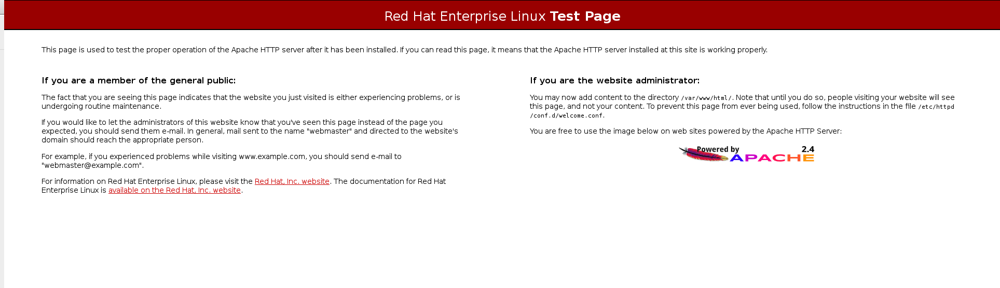
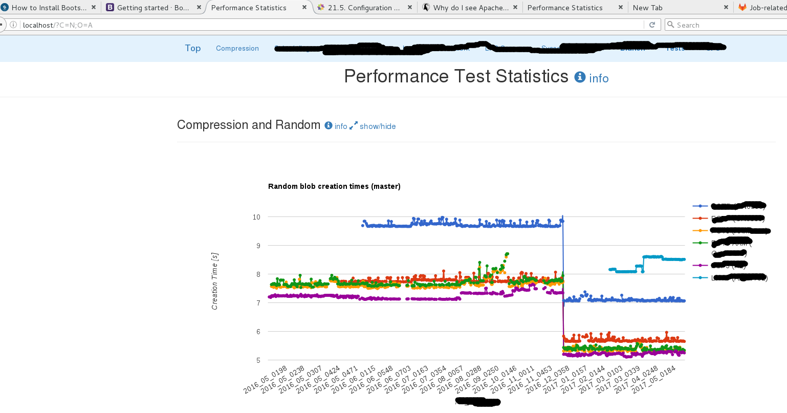

HTTP (Hypertext Transfer Protocol) server, or a web server, is a network
service that serves content to a client over the web. This typically means web
pages, but any other documents can be served as well. 

Apache HTTP Server 2.2

 a robust, full-featured open source web server developed by the Apache
 Software Foundation, that is included in Red Hat Enterprise Linux 6. It
 describes the basic configuration of the httpd service, and covers advanced
 topics such as adding server modules, setting up virtual hosts, or
 configuring the secure HTTP server. 

#### apache web server

    yum install httpd

    13:53 junhuawa@Tesla:~ $ httpd -v
    Server version: Apache/2.4.6 (Red Hat Enterprise Linux)
    Server built:   Mar  8 2017 05:09:47
    13:54 junhuawa@Tesla:~ $ 

Start web server

    apachectl start

Stop web server

    apachectl stop

Test if the web server is running



This welcome page show because of the test config file: `/etc/httpd/conf.d/welcome.conf` 

```html
    # 
    # This configuration file enables the default "Welcome" page if there
    # is no default index page present for the root URL.  To disable the
    # Welcome page, comment out all the lines below. 
    #
    # NOTE: if this file is removed, it will be restored on upgrades.
    #
    <LocationMatch "^/+$">
        Options -Indexes
        ErrorDocument 403 /.noindex.html
    </LocationMatch>

    <Directory /usr/share/httpd/noindex>
        AllowOverride None
        Require all granted
    </Directory>

    Alias /.noindex.html /usr/share/httpd/noindex/index.html
```

If we want to show real useful html page, first we need to comment all the code in `/etc/httpd/conf.d/welcome.conf`, 

From the `/etc/httpd/conf/httpd.conf`, we can see the `DocumentRoot` definition.

    #
    # DocumentRoot: The directory out of which you will serve your
    # documents. By default, all requests are taken from this directory, but
    # symbolic links and aliases may be used to point to other locations.
    #
    DocumentRoot "/var/www/html"

So, I need to copy the lfsPerfStats data(include index.html) to this directory.
Then restart the httpd, new web page will be displayed.



[Bootstrap Install](https://bootstrapbay.com/blog/install-twitter-bootstrap/)
[Config directives in httpd.conf](https://www.centos.org/docs/5/html/Deployment_Guide-en-US/s1-apache-config.html)
