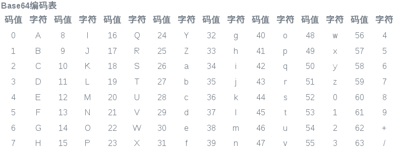

这两天有位同事也要装Linux系统连接公司网络办公，但是被连接公司Wifi失败卡住了，连接公司的网络需要配置Certificate，但是根据guide配置后一直连接不上，也不知道什么原因。 

我自己以前也配置过，但是我实际上也模模糊糊，不明白。今天特地查了下相关的资料，虽然还是不明白，但是先记录下一些有价值的发现.

我们使用的.crt, .key 都是用base64编码的，
这种编码方式目的是将二进制文件，转换成可读的字符串(可见字符). 比如如下的junhuawa.*.crt:

    -----BEGIN CERTIFICATE-----
    MIIDsTCCApmgAwIBAgICCEwwDQYJKoZIhvcNAQELBQAwOjEYMBYGA1UEChMPSVBB
    ...
    zJpNw9qL8P1jHOqLF+138y/hDLYo4BgzhkB+hIv9LlM4WQhpfDZT6adBEh3UKkay
    QFWlujHOlaGYU13EN7Y1VsZkIHUqBnUSD2aE7u40/YTySaG5nnfDytWmWq7KYh9b
    piUOQZNRHMdHOB9AzWThWsNeeMRGRL4S/1h3///sOatw2CnFqg==
    -----END CERTIFICATE-----

我们知道在计算机中任何数据都是按ascii码存储的，而ascii码的128～255之间的值是不可见字符。而在网络上交换数据时，比如说从A地传到B地，往往要经过多个路由设备，由于不同的设备对字符的处理方式有一些不同，这样那些不可见字符就有可能被处理错误，这是不利于传输的。所以就先把数据先做一个Base64编码，统统变成可见字符，这样出错的可能性就大大降低了。

### Base64 编码方法

Base64编码要求把3个8位字节（3*8=24）转化为4个6位的字节（4*6=24），之后在6位的前面补两个0，形成8位一个字节的形式。 如果剩下的字符不足3个字节，则用0填充，输出字符使用‘=’，因此编码后输出的文本末尾可能会出现1或2个‘=’。

为了保证所输出的编码位可读字符，Base64制定了一个编码表，以便进行统一转换。编码表的大小为2^6=64，这也是Base64名称的由来。

1.标准base64只有64个字符（英文大小写、数字和+、/）以及用作后缀等号；

2.base64是把3个字节变成4个可打印字符，所以base64编码后的字符串一定能被4整除（不算用作后缀的等号）；

3.等号一定用作后缀，且数目一定是0个、1个或2个。这是因为如果原文长度不能被3整除，base64要在后面添加\0凑齐3n位。为了正确还原，添加了几个\0就加上几个等号。显然添加等号的数目只能是0、1或2；

4.严格来说base64不能算是一种加密，只能说是编码转换。使用base64的初衷。是为了方便把含有不可见字符串的信息用可见字符串表示出来，以便复制粘贴；

X.509公钥证书也好，电子邮件数据也好，经常要用到Base64编码.

http://blog.csdn.net/xuplus/article/details/51613883

### Xunlei address translation

迅雷的地址一般也用base64编码, 可以用`base64 -d`对其进行解码.
解码出来，可以看出迅雷的链接头上一般带 "AA", 结尾一般带"ZZ".

    [junhuawa@Tesla ~]$ echo "QUFodHRwOi8vYWlrYW5keS5vcmcvW+efpeeUteW9sXd3dy56aGlkeS5jb21d44CQT01HIE9oIE15IEdvZCHjgJHjgJDpq5jmuIXok53lhYk3MjBQ54mIQkQtUk1WQi7kuK3lrZfjgJEucm12Yj9maWQ9eFZiZFpObUFWMk96dzNSLTNSdWI4ODdoNVdFQUFBQUFBQUFBQUFBQUFBQUFBQUFBQUFBQUFBQUFBQUFBQUFBQSZtaWQ9NjY2JnRocmVzaG9sZD0xNTAmdGlkPUU1MUREN0JDMDFBOTI4MkJBNzdFQzFDM0JFQjNDQkY3JnNyY2lkPTEyMCZ2ZXJubz0xWlo=" |base64 -d
    AAhttp://aikandy.org/[知电影www.zhidy.com]【OMG Oh My God!】【高清蓝光720P版BD-RMVB.中字】.rmvb?fid=xVbdZNmAV2Ozw3R-3Rub887h5WEAAAAAAAAAAAAAAAAAAAAAAAAAAAAAAAAAAAAA&mid=666&threshold=150&tid=E51DD7BC01A9282BA77EC1C3BEB3CBF7&srcid=120&verno=1ZZ
    [junhuawa@Tesla ~]$ 

比如这个链接 thunder://QUFodHRwOi8vYy5zcXd1eXQuY29tL2dnZzk2My5yYXJaWg==,
用 base64 解码出来如下:

    echo "QUFodHRwOi8vYy5zcXd1eXQuY29tL2dnZzk2My5yYXJaWg==" |base64 -d
    AAhttp://c.sqwuyt.com/ggg963.rarZZ09:01
