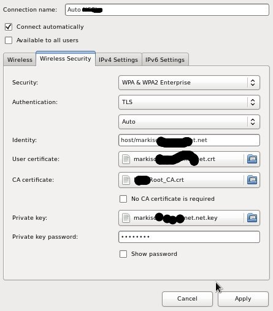

#### What is the difference between .pem , .csr , .key and .crt?

    .pem stands for PEM, Privacy Enhanced Mail; it simply indicates a base64 encoding with header and footer lines. Mail traditionally only handles text, not binary which most cryptographic data is, so some kind of encoding is required to make the contents part of a mail message itself (rather than an encoded attachment). The contents of the PEM are detailed in the header and footer line - PEM itself doesn't specify a data type (just like XML or HTML doesn't, it just specifies a specific encoding structure);

    .key can be any kind of key, but usually it is the private key - OpenSSL can wrap private keys for all algorithms (RSA, DSA, EC) in a generic and standard PKCS#8 structure, but it also supports a separate 'legacy' structure for each algorithm, and both are still widely used even though the documentation has marked PKCS#8 as superior for almost 20 years; both can be stored as DER (binary) or PEM encoded, and both PEM and PKCS#8 DER can protect the key with password-based encryption or be left unencrypted;

    .csr stands for Certificate Signing Request, it is what you send to a third party when you require a certificate to be signed (by a third party), the encoding could be PEM or DER (which is a binary encoding of an ASN.1 specified structure);

    .crt stands simply for certificate, usually an X509v3 certificate, again the encoding could be PEM or DER; a certificate contains the public key, but it contains much more information (most importantly the signature by the Certificate Authority over the data and public key, of course).

If they begin with -----BEGIN and you can read them in a text editor (they use base64, which is readable in ASCII, not binary format), they are in PEM format.

https://stackoverflow.com/questions/991758/how-to-get-pem-file-from-key-and-crt-files

#### What is the difference between SSL and X.509 Certificates?

SSL is by far the largest use of X.509 certificates, many people use the terms interchangeably. They're not the same however; a "SSL Certificate" is a X.509 Certificate with Extended Key Usage: Server Authentication (1.3.6.1.5.5.7.3.1).

Other "common" types of X.509 certs are Client Authentication (1.3.6.1.5.5.7.3.2), Code Signing (1.3.6.1.5.5.7.3.3), and a handful of others are used for various encryption and authentication schemes.

#### SSL 和 TLS的区别

    SSL: Secure Socket Layer (安全套接层) 
    TLS: Transport Layer Security Protocol (安全传输层协议)

互联网加密通信的历史，几乎与互联网的历史一样长。 

    1994年，NetScape公司设计了SSL协议（Secure Sockets Layer）的1.0版，但是未发布。
    1995年，NetScape公司发布SSL 2.0版，很快发现有严重漏洞。
    1996年，SSL 3.0版问世，得到大规模应用。
    1999年，互联网标准化组织ISOC接替NetScape公司，发布了SSL的升级版TLS 1.0版。
    2006年和2008年，TLS进行了两次升级，分别为TLS 1.1版和TLS 1.2版。最新的变动是2011年TLS 1.2的修订版。

TLS 是标准化之后的SSL. 很多相关的文章都把这两者并列称呼（SSL/TLS），因为这两者可以视作同一个东西的不同阶段。

HTTPS: 就是HTTP和SSL/TLS协议的组合， 可以将HTTPS理解为HTTP over SSL 或者HTTP over TLS.

#### Create a private key and a certificate request

    openssl req -new -newkey rsa:2048 \
        -keyout markiso.*.net.key \
        -out markiso.*.net.csr

#### Check a certificate's validaty period

    openssl x509 -in ~/certs/junhuawa.*.net.crt -dates

    notBefore=Aug 11 02:23:22 2016 GMT
    notAfter=Aug 12 02:23:22 2018 GMT

#### Company Wifi Network Setting for Connection

