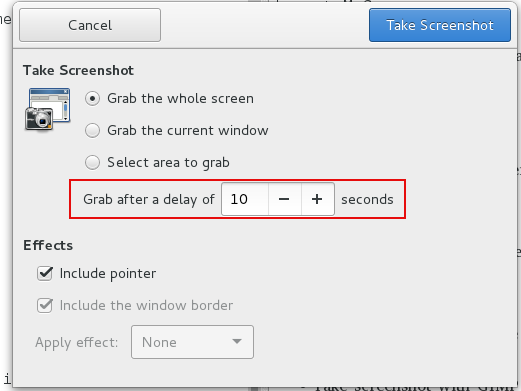

### My Linux OS

    [junhuawa@Tesla Pictures]$ uname -a
    Linux Tesla 3.10.0-327.22.2.el7.x86_64 #1 SMP Thu Jun 9 10:09:10 EDT 2016 x86_64 x86_64 x86_64 GNU/Linux
    [junhuawa@Tesla Pictures]$ cat /etc/redhat-
    redhat-access-insights/ redhat-lsb/             redhat-release          
    [junhuawa@Tesla Pictures]$ cat /etc/redhat-release 
    Red Hat Enterprise Linux Client release 7.2 (Maipo)
    [junhuawa@Tesla Pictures]$ 

### How to return terminal from a ssh connection?

Normal keys are forwarded over the ssh session, so none of those will work. Instead, use the escape sequences. 
To kill the current session hit subsequently Enter ~,..  
Note that escapes are only recognized immediately after newline.

### Tool to manipulate pictures

GIMP: GNU Image manipulation program

Pinta: A very simple image editor. Pinta is a drawing/editing program modeled on Paint.NET. 
Its goal is to provide a simplified alternative to the GIMP for casual users. 

### bittorrent client
    yum search torrent
    yum install qbittorrent

### Get a rpm package's content

rpm -ql package

-l, --list
List files in package.

    [junhuawa@Tesla docomo-ps]$ rpm -ql qbittorrent
    /usr/bin/qbittorrent
    /usr/share/appdata/qBittorrent.appdata.xml
    /usr/share/applications/qBittorrent.desktop
    /usr/share/doc/qbittorrent-3.3.5
    /usr/share/doc/qbittorrent-3.3.5/AUTHORS
    ...
    /usr/share/pixmaps/qbittorrent.png
    [junhuawa@Tesla docomo-ps]$ 

### Convert an rpm package to cpio archive package

    rpm2cpio *.rpm|cpio -itmv

### Query rpm package owning file "/etc/environment"

    rpm -qf /etc/environment

    [junhuawa@Tesla docomo-ps]$ rpm -qf /etc/environment 
    setup-2.8.71-6.el7.noarch

### Create a terminal in linux terminal
    gnome-terminal -e "ssh root@10.69.120.13"

### Tool to manage ssh sessions in Linux

    pac-4.5.5.7-2.x86_64

fcitx，ibus是输入法的一种框架，具体的输入法一般都有google pinyin,sogou pinyin等；不要将输入法框架和输入法本身搞混淆；

### Use Jabra UC VOICE 750 Duo Drk in Redhat

After plug-in the Jabra, select Jabra UC VOICE 750a as the device for sound output/input in System Tools -> Settings -> Sound.

### Use usb device in the windows VM in Redhat 7.2

* Add vboxusers group for your username, if not, no usb devices can be selected for VM, relogin the user, 
in order for the newly added group to get picked up by your user account.

    sudo usermod -a -G vboxusers  junhuawa  
    groups junhuawa

    [junhuawa@Tesla ~]$ groups junhuawa  
    junhuawa : everybody vboxusers  
    [junhuawa@Tesla ~]$  

* In the USB Settings, Enable USB Controller(USB 2.0 EHCI Controller)

* In the USB Device Filters, select you wanted USB devices  

### Take Screenshots in Linux

* Take a snapshot of screen in linux by PrintScreen Button

    fn + PrintScreen

    The image will be saved to Picutures directory with name "Screenshot from 2016-xx-xx xx-xx-xx.png"

* Take snapshot by Screenshot tool in gnome

    It has delay to take snapshot function    

* Use command line, need install imagemagick

    show imagemagick version:
    import --version

    [junhuawa@Tesla misc]$ rpm -qa |grep ImageMagick
    ImageMagick-6.7.8.9-15.el7_2.x86_64
    [junhuawa@Tesla misc]$ 

Command:

    import MyScreen.png

then, use mouse select an area, a png file will be created in current directory.

show the image:

    eog MyScreen.png

To capture the entire screen after a delay (so you can open some menus or whatever)

    sleep 10; import -window root MyScreenshot2.png

import -window root, tells ImageMagick to import the "root" window — that is, the entire screen. 

    sleep 15; import -window root MyScreenshot3.png; gimp MyScreenshot3.png;

Take a screenshot and resize the image to a width of 500 pixels:
    import -window root -resize 500 AnotherScreenshot.png

* Take screenshot with GIMP

To take a screenshot with the GIMP, find the following menu option: File —> Create —> Screen Shot. 

You will then be offered some options for the screenshot such as length of delay and whether you want to take a screenshot of the entire screen, or just a window. Click Snap to take the screenshot, 
When you're finished, the screenshot will open in the GIMP editing window. 

* Other methods

[http://tips.webdesign10.com/how-to-take-a-screenshot-on-ubuntu-linux](URL)

LXC: linux container
