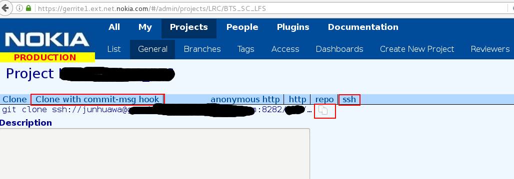

### Gerrit

代码push到gerrit, 必须要有Change-Id. 如果一个gerrit的change被abandon了,
可以通过Restore Change来恢复这个change. 

如果需要修改Gerrit上Change的commit msg,
则不需要在terminal上修改，而直接可以在gerrit的web上修改,
点击Permalink边上的按钮就可以修改. 

### Gerrit Commit Msg

用gerrit review code, push到gerrit server之前, commit msg里必须包含ChangeID,
gerrit用ChangeID来跟踪一个review过程(因为一个review会有好几次code
change和commit). 
ChangeID 为了跟commit ID区分，ChangeID是以I开头的一串sha1 值. 

当然用gerrit review也可以不用ChangeID，但是server要重新设置一下. 
生成ChangeID的hook 脚本通常从gerrit server上copy下来.
实际上这个copy命令也包含在gerrit server提供的clone命令里面. 如下图:

    git clone ssh://junhuawa@gerrite1.ext.net.nokia.com:8282/LRC/BTS_SC_LFS && scp -p -P 8282 junhuawa@gerrite1.ext.net.nokia.com:hooks/commit-msg BTS_SC_LFS/.git/hooks/

一个包含ChangeID的commit msg如下:

    commit 1ee3821df05e4b105294b69e084688f34c734e35
    Author: junhuawa <junhua.h.wang@nokia-sbell.com>
    Date:   Fri Aug 11 14:43:41 2017 +0800

        %FIN %PR=PR267356
        PR267356 [17B][[RLDNH6.0][FHM][LTE3373_M][interaction] Unexpected LTE cell addcellap success when LTE and 3G data bit is overlap
        SOLUTION: $WA:No $LI:No
        IMPACT: $PERF:No $SPEC:No $TEST:No $TEST_ID:NA $SCM:Yes $COMP: No
        
        Change-Id: I13c6d6c5d9161d0e20016c0c8222f6109d920c28

一个普通的commit msg如下:

    commit 67d15f3d3060d084ef1f56d39a9a218a3c066dde
    Author: Wang Junhua <junhua.h.wang@nokia.com>
    Date:   Fri Aug 11 15:28:59 2017 +0800

        add update to how to commit code to gerrit review, trunk, branch

详细的Gerrit
Change-ID信息可以参考[这里](https://review.openstack.org/Documentation/user-changeid.html)

[Gerrit: Google-style code review meets git](https://lwn.net/Articles/359489/)

### 里特维尔德（Gerrit Rietveld, 1888-1964） 

里特维尔德生于乌特勒支市，是荷兰著名的建筑与工业设计大师、荷兰风格派的重要代表人物。他非常偏爱单纯的线条、颜色，以便大量制造，这种简洁的设计概念深刻地影响了日后的设计界。 
里特维尔德1917年设计了现代主义设计运动的重要经典作品红/蓝椅，以一种实用产品的形式生动地解释了风格派抽象的艺术理论。他1934年设计了曲折椅，椅子的脚、座椅部分及靠背都摆脱了传统椅子的造型，非常节省空间。这张椅子是这位大师最具代表性的作品之一。1925年，里特维尔德设计了位于乌特勒列支市的什罗德住宅和住宅内的室内设计及家具设计，此建筑的风格完全是风格派的立体化体现。 
风格派对于世界现代主义的风格形成起有很大的影响作用，它的简单的几何形式，以中性色（白、黑、灰）为主的色彩计划，以及立体主义造型和理性主义的结构特征在两次世界大战之间成为国际主义风格的标准符号。

### Gerrit: Google-style code review meets git

Gerrit, 一个基于git的Code Review 管理系统,
帮助将分布是版本控制系统推广到许多使用Android的公司,
其中许多公司对软件产品质量, 管理和法律流程要求苛刻.
在2009年10月于山景城谷歌主持的GitTogether event会议上, Gerrit project leader
Shawn Pearce说: HTC, Qualcomm, TI, Sony Ericsson,
还有Android的鼻祖谷歌都在用Gerrit. 

Gerrit的故事始于一次谷歌私有的过程和工具的激进的逃离.
对于所有的公司代码和配置文件的改变, 谷歌都要求Code Review. 有一些例外,
但是在部署完了之后还是需要review. Code review 过程最开始是通过大量的email,
但是过去的几年已经有所改进, 很多都已经自动化. 2005年, Python创始人, Guido van
Rossum 加入谷歌, 他开始开发一种工具, 自然是用python写的, 用于做Code Review.
结果，一个叫Mondrian的工具诞生了, 这个工具通过新旧Code的比较,
让用户清晰的看到做的change, 同时用户可以在代码任何位置添加comments.
一个概要页显示了需要review的changes list, 还有reviewers的comments.
在2006年的一次公开演讲中, Van Rossum向大家展示了Mondrian. 

在谷歌内部, Mondrian已经是一个巨大的成功, Pearce曾说:
几乎每个工程师每天都用它. 但是Mondrian严重依赖于谷歌内部的架构,
包括谷歌自创的Bigtable 非关系表存储和私有的Perforce版本控制系统.  Google
是一个超级大的Perforce商店, 他已经建立了高度定制化的IT  infrastructure,
包括依赖于Perforce的工具. 

为了让Mondrian风格的工具让更多的人使用, Van Rossum于2008年发布了Rietveld,
他使用subversion而不是Perforce作为版本控制系统, 并且采用Google App
Engine而不是Google Internals作为公共接口. 他是根据现代架构师Gerrit
Rietveld命名. 因为后来谷歌开始了Android项目, 开发者要求一个类似于Mondrian,
但是跑在git上面的code review 工具, 因为他们的代码用git管理. Google App Engine
是一个deal breaker,
因为生产基于Android的产品的移动硬件厂家维护了他们内部的repo, 不想用外部的服务. 

Shawn Pearce 过去曾经用java重新实现了git, 取名为JGit, 现在在谷歌,
他开始勇当重任, 结果出现了Gerrit Code Review,
现在用于跟踪针对Android代码的公共的change. Android应用用Java编写,
如果这个工具用java编写, 则会让其在Android 开发者中更受欢迎,
并且有更多的人会成为贡献者. 

Gerrit 基于Mina SSH Daemon和JGit运行, JGit目前作为Eclipse EGit
project的一部分维护. 尽管这个组合比原来的基于openssh的git的组合慢, 对于Android
开发者来说已经足够快. Pearce说: 整个android团队都用它作为他们与git的接口.
服务器侧的依赖是Tomcat 和SQL database,  SQL database可以是MYSQL， PostgreSQL,
或者H2. 默认情况下, Gerrit使用OpenID做认证, 但是也可以设置成使用HTTP basic,
或者摘要认证, 或者siteminder, 或者采用Single-sign-on系统. 

在UI侧, Gerrit使用Google Tool Webkit. Google Tool
Webkit是一个基于Apache协议的项目,
它可以将Java代码编译成带AJAX功能的Javascript. UI上有一些小的便利的Flash widget, 比如copy git command lines to the clipboard. 
但是Flash不是必须的. 

如果一个用户不想使用web接口, 他也可以ssh到gerrit服务器去执行命令.
Gerrit不会强制任何特殊的流程,
使得git更像是一个集中的版本控制系统(产生了Mondrian和Rietveld).
一个使用gerrit的开发者, 如果已经安装了git,
他依旧可以做各种分布式版本控制系统的tricks, 比如从一个更新的upstream release
cherry-picking. Gerrit仅仅是保卫他自己的repo的访问. 

A developer can set up a git repository with "origin" pointing back to an
ssh:// URL on the Gerrit server, and do something like centralized
development, or do "drive-by" interactions with a Gerrit server like any other
Git repository. ?

通过gerrit提交一个change, 开发者必须为这个change创建一个分支. 每个change,
和change的每一次迭代, 都变成了一个新的branch.
为了保留同一个工作的连续的版本的信息, Gerrit引进了一个git hook,
这个hook可以在commit msg里添加"Change-Id"行. 在做了对Gerrit server的'git
push'之后, 开发者可以到web dashboard, 看到挂起的change的状态,
然后发起一个code review的请求.  有一个叫Repo的Wrapper,
能够让开发者在pushchange时命令行上指定一个reviewer. 

一旦一个reviewer被选中, Gerrit开始发送email, email中包含这个Gerrit page的URL,
和让reviewer pull change的git 命令行. 在change page,
reviewer能够看到一块一块的change其中还包含原始代码, 或者就是diff,
reviewer可以在代码的任何地方加上comments.  Approval有多个级别,
一个reviewer可用的级别是可配的.  通常, 一个个人开发者可以使用-1或者+1,
意味着"期望不要submit' 和"I like it". 有些人有-2"不要submit",
和+2"Approved"级别.  通过web接口review代码不是必须的,
一个reviewer也可以ssh到Gerrit server来approve或者reject一个change. 

一个被拒绝和需要重新修改代码提交的change, 在其commit消息里面包含'Change-Id',
这个用于保护gerrit的metadata, 通过这个,
reviewer能够看到他或她的原始的comments, 还有提交者的回复,
在已经有comments的地方追加comments,
或者在新版本的代码的任何地方提交新的comments. 如果这个改动(Change)不被接收,
那么这个新版本应该在一个新的branch上. 

内核开发者David Brown, 他在Qualcomm Innovation Center,
和他的团队使用git和gerrit. 他说: 到目前为止,
人们对gerrit最大的报怨是必须经常rebasing their changes. 然而,
为了让所有的东西都遵守free software license, 公司扩充了review过程,
gerrit将有权检查代码的人引入到流程里面, 使得整个review过程流水化. 

Brown说: "从去年开始, 最大的改变是Gerrit, 第二个最大的改变是Gerrit“, 但是,
他又说"用Gerrit的方式工作可行!", 他说:
"大多数人只要学习git的一个相对小的子集就够了, 很小的一个子集."

Gerrit配置时可以自动设置一些策略. Pearce说: '人们需要很多不同的工作模型.'
比如, Gerrit能够设置成对signed contributor agreement的强制检查.
在Android的公共Gerrit实例上, 除了kernel之外, 其他模块都要求强制的contributor
agreement requirement, 对于kernel, 只要求"Signed-off-by" 行. Gerrit
能够跟bug跟踪系统(Bug Tracking System)整合在一起,
但是因为每个人都有一个不一样的bug跟踪系统, 而且大家都对自己的情有独钟,
因此这种整合是完全根据个人的需求来做的. 

除了更好的BTS整合, Pearce 正在寻找一种将Gerrit metadata存储在git的方式.
"我们想让Gerrit做的事情全部线下完成, 线下不能做实际上是一个bug."

Android开发者正在考虑怎样与上游建立链接. Staging Maintainer Greg Kroah-Hartman
计划丢掉2.6.33内核版本的Android driver/staging,
因为"没有人想要维护他们，也没有人想要将他们合到内核里面"， 他在email中说.
不仅仅是明显的driver速度太慢,  和企业文化改变,
还因为Qualcomm和TI开始一些管理输出代码的项目. Qualcomm是Code Aurora
Forum的领袖, TI是OmapZoom.org的领袖. 在移动工业的潜在雷区里,
考虑到安全的支持第三方应用, 不要专利困扰的部署codecs和GUI代码, 并且兼容radio
regulations, Gerrit作为一个守门员功不可没. 

